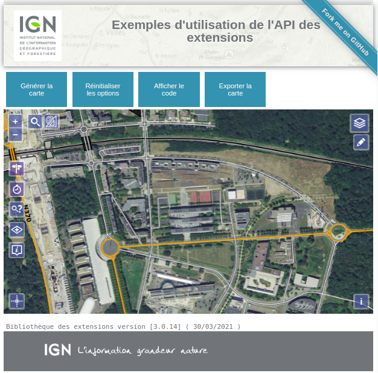

# vuejs / geoportal-extensions

Exemples d'utilisation de l'API des extensions du Géoportail (geoportal-extensions).

## Prerequisites

* [Git](https://git-scm.com/)
* [Node.js](https://nodejs.org/) (with npm)
* [VueJS](https://fr.vuejs.org/)
* [Google Chrome](https://google.com/chrome/)
* [DevTool VueJS](https://devtools.vuejs.org/guide/installation.html)

**NOTE**
> testé avec nodeJS 16.14.0 / npm 8.3.1

## Installation

* `npm install`

## Running / Development

* `npm run serve`
* Visit your app at [http://localhost:8085](http://localhost:8085).

### Linting

* `npm run lint`
* `npm run lint -- --fix`

### Building

* `npm run build` (production)
* `npm run build -- --mode development` (development)

### Upgrade UI

Extract widget options from jsdoc to update UI

* `npm run doclets`

### Deploying

Specify what it takes to deploy your app.

### Docker

* `docker build -t dockerize-vuejs-app .`
* `docker run -it -p 8888:80 --rm --name dockerize-vuejs-app-1 dockerize-vuejs-app`

avec un accès à notre app sur http://localhost:8888

## Upgrade dependencies

<https://blog.vuejs.org/posts/vue-2-7-naruto#vue-cli-webpack>

## Migrate to Vue3

<https://v3-migration.vuejs.org/>

Download Pdf : <https://www.vuemastery.com/migration-guide-cheat-sheet/>

## Further Reading / Useful Links

* [vue.js](https://fr.vuejs.org/)
* [vue-cli](https://cli.vuejs.org/)
